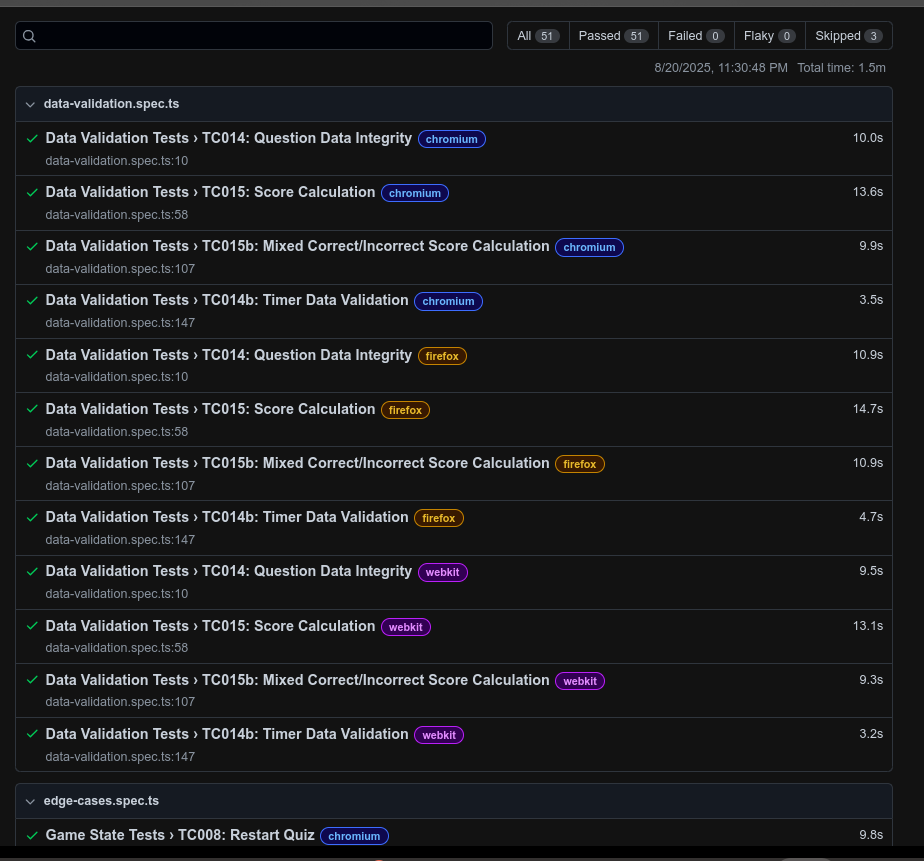
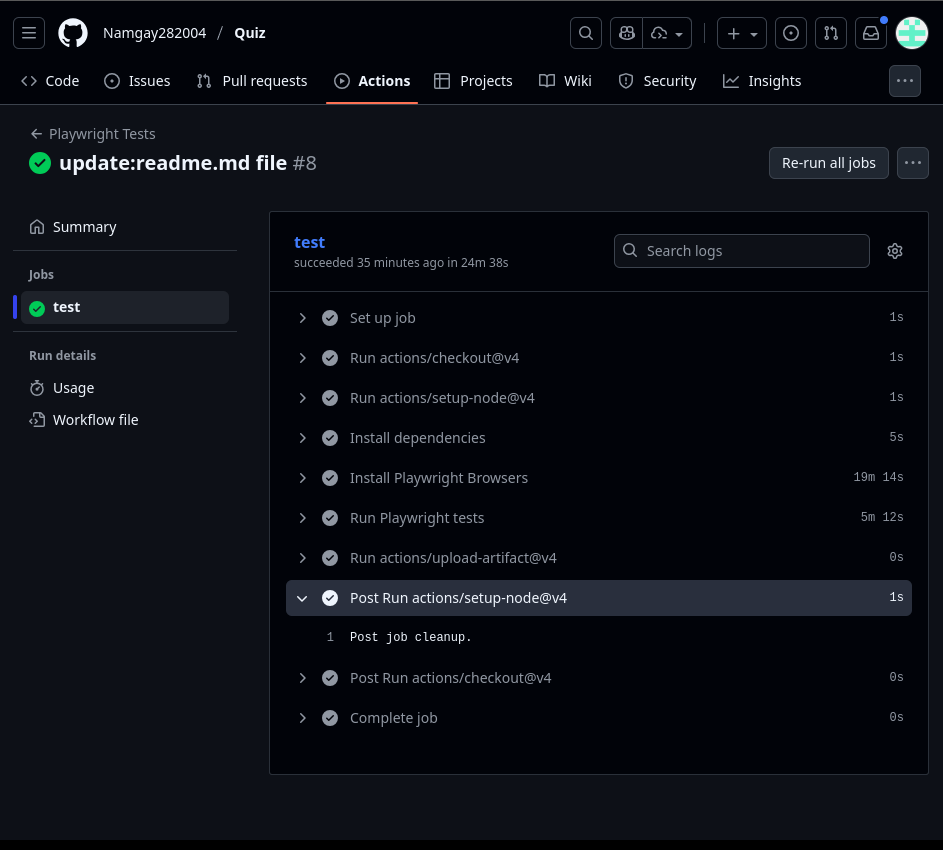
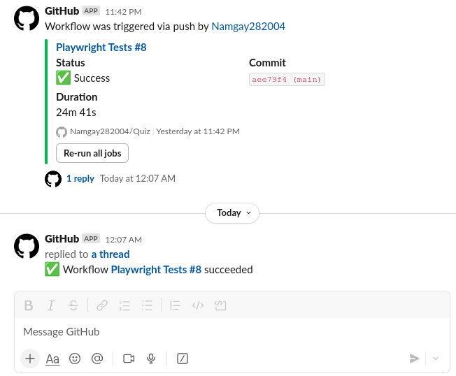

# Practical: End-to-End Tests using Playwright

This practical demonstrates the implementation of automated end-to-end testing using Playwright, including CI/CD integration with GitHub Actions and Slack notifications.

## Overview

This project showcases:
- Comprehensive end-to-end test coverage using Playwright
- Continuous Integration with GitHub Actions
- Automated Slack notifications for build status

## Screenshots

### 1. Playwright Test Results
All test cases successfully passed in the Playwright test suite:

### 2. GitHub Actions Workflow
All test cases passed successfully in the GitHub Actions CI pipeline:

### 3. Slack Notifications
Automated notifications triggered via push/commit events:

## 🔗 Source Code

View the complete implementation: [**Quiz Application Repository**](https://github.com/Namgay282004/Quiz)

---
*This practical demonstrates the complete testing workflow from local development to production deployment with automated notifications.*