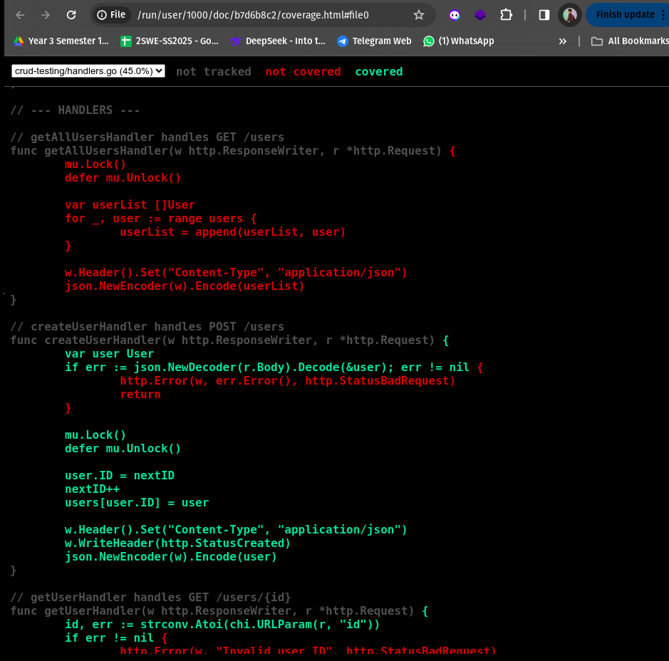

# Practical: Go CRUD API Testing with Code Coverage

This practical demonstrates the implementation of comprehensive unit testing for a Go CRUD API using the Chi router, including test coverage analysis and HTML coverage reports.

## Overview

This project showcases:
- Complete CRUD API implementation using Go and Chi router
- Comprehensive unit test coverage for all HTTP handlers
- Code coverage analysis with detailed HTML reports
- Best practices for HTTP testing with httptest package

## Screenshots

### 1. Terminal Command - Test Coverage Generation
Running the test suite with coverage profile generation:


*Command executed: `go test -coverprofile=coverage.out`*

### 2. Code Coverage HTML Report
Interactive HTML coverage report showing line-by-line coverage analysis:



*Generated using: `go tool cover -html=coverage.out`*

## Test Coverage Results

The test suite covers all major CRUD operations:

- ✅ **Create User Handler** (`POST /users`)
  - Tests successful user creation
  - Validates response status and JSON structure
  
- ✅ **Get User Handler** (`GET /users/{id}`)
  - Tests successful user retrieval
  - Tests user not found scenarios
  
- ✅ **Delete User Handler** (`DELETE /users/{id}`)
  - Tests successful user deletion
  - Verifies user removal from in-memory store

## Key Testing Features

### HTTP Testing Framework
- Uses `net/http/httptest` for HTTP request/response testing
- Implements `httptest.ResponseRecorder` for capturing responses
- Chi router integration for realistic endpoint testing

### Test Structure
- **Setup/Teardown**: `resetState()` function ensures test isolation
- **Subtests**: Organized test cases using `t.Run()` for better organization
- **Assertions**: Comprehensive status code and response body validation

### Code Coverage Analysis
- **Coverage Profile**: Generated using `-coverprofile=coverage.out`
- **HTML Reports**: Interactive coverage visualization with `go tool cover -html`
- **Line Coverage**: Detailed analysis showing covered vs uncovered code paths

## 🔗 Source Code

View the complete implementation: [**Go CRUD Testing Repository**](https://github.com/Namgay282004/GO-CRUD-API)

## Project Structure

```
go-crud-testing/
├── main.go              # Main application entry point
├── handlers.go          # CRUD operation handlers
├── handlers_test.go     # Comprehensive test suite
├── go.mod              # Go module dependencies
├── go.sum              # Dependency checksums
├── coverage.out        # Generated coverage profile
└── practical2.md       # This documentation
```

## Running the Tests

```bash
# Run tests with verbose output
go test -v

# Generate coverage profile
go test -coverprofile=coverage.out

# View coverage in terminal
go tool cover -func=coverage.out

# Generate HTML coverage report
go tool cover -html=coverage.out
```

---
*This practical demonstrates comprehensive Go API testing with detailed coverage analysis, ensuring robust and reliable CRUD operations.*
