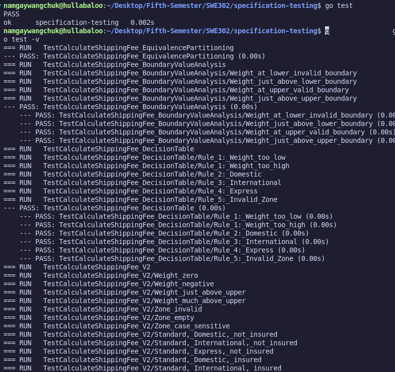

# Shipping Fee Calculator: Specification-Based Testing

### [Link to the source code](https://github.com/Namgay282004/Specification-testing)

## Overview

This project demonstrates how to apply specification-based (black-box) testing techniques—**Equivalence Partitioning**, **Boundary Value Analysis**, and **Decision Table Testing**—to a shipping fee calculator written in Go.  
The implementation and tests are based strictly on the business requirements, not the internal code.

---

## Screenshot of All Tests Passing



---

## Equivalence Partitioning

| Partition  | Input   | Partition Name  | Description / Example Values           |
| :---: | :---: | :---: | :--- |
| P1 | Weight  | Invalid Low   | ≤ 0 (e.g., -5, 0) |
| P2 | Weight  | Standard      | 0 < weight ≤ 10 (e.g., 1, 5, 10) |
| P3 | Weight  | Heavy         | 10 < weight ≤ 50 (e.g., 11, 25, 50) |
| P4 | Weight  | Invalid High  | > 50 (e.g., 51, 100) |
| P5 | Zone    | Valid         | "Domestic", "International", "Express" |
| P6 | Zone    | Invalid       | Any other string (e.g., "Local", "", etc.) |
| P7 | Insured | Not Insured   | false |
| P8 | Insured | Insured       | true |

---

**Why:**  
These partitions ensure that all meaningful categories of input are tested, including both valid and invalid cases for each parameter.


## Boundary Value Analysis

| Boundary Area         | Test Value | Description                      |
|----------------------|------------|----------------------------------|
| Lower Weight         | 0          | Last invalid                     |
| Lower Weight         | 0.01       | First valid                      |
| Standard/Heavy Split | 10         | Last "Standard" valid            |
| Standard/Heavy Split | 10.01      | First "Heavy" valid              |
| Upper Weight         | 50         | Last valid                       |
| Upper Weight         | 50.01      | First invalid                    |

**Why:**  
Bugs often occur at the edges of valid ranges. Testing just below, at, and just above each boundary ensures the implementation handles these critical points correctly.

---

## Files Included

- `shipping.go`  
  Implementation of the shipping fee calculator (new specification).

- `shipping_test.go`  
  Tests for the function using equivalence partitioning, boundary value analysis, and decision table testing.

- `shipping_v2_test.go`  
  Comprehensive table-driven tests for the new function signature and business rules.

---

## How to Run

1. Make sure you have Go installed.
2. Initialize the module if you haven't:
    ```sh
    go mod init specification-testing
    ```
3. Run all tests:
    ```sh
    go test
    ```

---

## Notes

- All tests are designed based solely on the specification, not the implementation.
- The test suite covers all input partitions and boundaries, as well as combinations of business rules.

---


