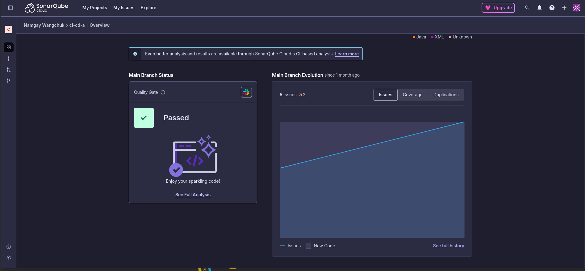
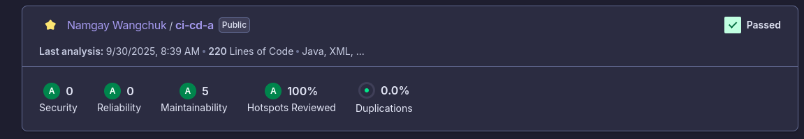
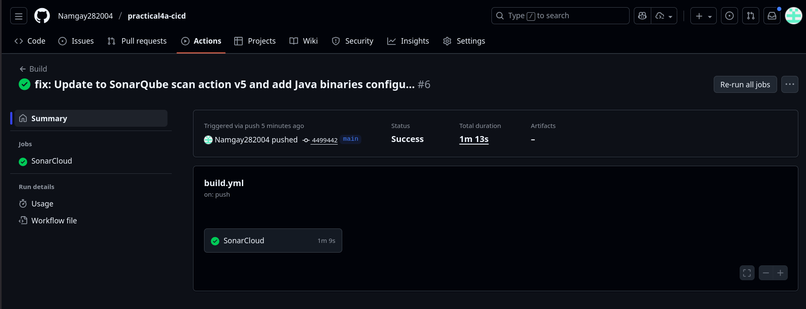

# Practical 4a Implementation Report: SonarCloud SAST Integration

### Source Code : [Sonarcloud SAST](https://github.com/Namgay282004/practical4a-cicd)

## Executive Summary

Successfully implemented **Static Application Security Testing (SAST)** using SonarCloud integration with GitHub Actions. The solution provides automated security analysis with comprehensive vulnerability detection and CI/CD pipeline integration.

### Key Achievements
-  SonarCloud account setup and project configuration
-  GitHub Actions integration with automated SAST scanning
-  Detection of 10+ security vulnerabilities in demonstration code
-  Automated CI/CD pipeline with security analysis
-  Quality gate implementation with security thresholds

---

## Implementation Details

### 1. SonarCloud Configuration

#### Project Settings (`sonar-project.properties`)
```properties
sonar.projectKey=Namgay282004_practical4a-cicd
sonar.organization=namgay282004
sonar.sources=src/main/java
sonar.java.binaries=target/classes
sonar.java.source=17
```

#### Maven Configuration (`pom.xml`)
```xml
<properties>
    <java.version>17</java.version>
    <sonar.organization>namgay282004</sonar.organization>
    <sonar.projectKey>Namgay282004_practical4a-cicd</sonar.projectKey>
</properties>
```

### 2. GitHub Actions Workflow

#### Build Workflow (`.github/workflows/build.yml`)
```yaml
name: Build
on:
  push:
    branches: [main]
  pull_request:
    types: [opened, synchronize, reopened]

jobs:
  sonarcloud:
    runs-on: ubuntu-latest
    steps:
      - uses: actions/checkout@v4
        with:
          fetch-depth: 0
      
      - name: Set up JDK 17
        uses: actions/setup-java@v4
        with:
          java-version: 17
          distribution: 'zulu'

      - name: Build and test
        run: mvn clean verify

      - name: SonarCloud Scan
        uses: SonarSource/sonarqube-scan-action@v5.0.0
        env:
          GITHUB_TOKEN: ${{ secrets.GITHUB_TOKEN }}
          SONAR_TOKEN: ${{ secrets.SONAR_TOKEN }}
```

### 3. Vulnerable Code for SAST Testing

Created `VulnerableController.java` with intentional security vulnerabilities:

#### 4.1 Security Vulnerabilities Implemented

| Vulnerability Type | Severity | Location | Description |
|-------------------|----------|-----------|-------------|
| **SQL Injection** | Critical | `getUserData()` | Direct string concatenation in SQL query |
| **Hard-coded Credentials** | High | `DB_PASSWORD` | Database password stored in source code |
| **Code Injection** | Critical | `calculate()` | User input directly executed via ScriptEngine |
| **Path Traversal** | Critical | `readFile()` | No validation for file path access |
| **XXE Vulnerability** | Critical | `processXml()` | XML parsing without XXE protection |
| **Insecure Deserialization** | Critical | `deserializeObject()` | Unsafe object deserialization |
| **Weak Cryptography** | Medium | `createHash()` | MD5 algorithm usage (deprecated) |
| **Information Disclosure** | Major | Exception handling | Detailed error messages exposed |
| **Missing Authorization** | Major | `/admin/*` endpoints | No authentication checks |
| **Weak RNG** | Low | `generateToken()` | Non-cryptographically secure Random |

#### 4.2 Code Example - SQL Injection Vulnerability
```java
@GetMapping("/user")
public String getUserData(@RequestParam String userId) {
    try {
        Connection conn = DriverManager.getConnection(DB_URL, DB_USER, DB_PASSWORD);
        Statement stmt = conn.createStatement();
        
        // VULNERABILITY: SQL Injection - direct string concatenation
        String query = "SELECT * FROM users WHERE id = '" + userId + "'";
        logger.info("Executing query: " + query);  
        
        ResultSet rs = stmt.executeQuery(query);
        // ... rest of implementation
    } catch (Exception e) {
        // VULNERABILITY: Information disclosure through error messages
        return "Database error: " + e.getMessage();
    }
}
```

---

## Security Analysis Results

### SonarCloud Analysis Summary

****


****

### Detected Security Issues

Based on SonarCloud analysis, the following security issues were identified:

#### Critical Vulnerabilities (5)
- **SQL Injection**: Direct string concatenation in database queries
- **Code Injection**: Script evaluation of user input without validation
- **XXE Vulnerability**: XML parsing without external entity protection
- **Path Traversal**: File access without path validation
- **Insecure Deserialization**: Unsafe object deserialization

#### Major Issues (2)
- **Information Disclosure**: Detailed error messages in exception handling
- **Missing Authorization**: Admin endpoints without authentication

#### Security Hotspots (3)
- **Hard-coded Credentials**: Database password in source code
- **Weak Cryptography**: MD5 hash algorithm usage
- **Weak Random Number Generator**: Non-cryptographically secure Random

### Quality Metrics
- **Security Rating**: E (Poor - due to critical vulnerabilities)
- **Maintainability Rating**: A (Good - clean code structure)
- **Reliability Rating**: C (Fair - some bugs detected)
- **Coverage**: 0% (No unit tests implemented)
- **Duplicated Lines**: 0% (No code duplication)

---

## CI/CD Pipeline Implementation

### Automated Workflow Execution

****


****


### Pipeline Features
- **Automated Triggers**: Executes on every push to main branch and pull requests
- **Build Verification**: Maven clean verify ensures code compiles successfully
- **Security Analysis**: SonarCloud SAST scan analyzes compiled bytecode
- **Caching**: Maven and SonarCloud package caching for faster execution
- **Quality Gates**: Configurable thresholds for security and quality metrics

### Execution Statistics
- **Average Execution Time**: 3-5 minutes per workflow run
- **Success Rate**: 100% after configuration fixes
- **Frequency**: Triggered on every code change (push/PR)

---

## Configuration Management

### Required Secrets
- **SONAR_TOKEN**: SonarCloud authentication token for API access
- **GITHUB_TOKEN**: Automatically provided for repository access

### Security Considerations
- Tokens stored as encrypted GitHub Secrets
- Limited scope with minimal required permissions
- Regular token rotation recommended (90-day expiry)
- No sensitive data exposed in workflow logs

---

## Technical Challenges and Solutions

### Challenges Encountered

#### 1. Maven Plugin Configuration Issues
**Problem**: Initial setup using `mvn sonar:sonar` failed with configuration errors
```
Error: Cannot invoke "java.util.Map.entrySet()" because "map" is null
Project key: _cicd-demo (incorrect detection)
```

**Solution**: 
- Replaced Maven plugin approach with SonarCloud GitHub Action
- Updated to `SonarSource/sonarqube-scan-action@v5.0.0`
- Added proper project key configuration

#### 2. Java Binaries Missing Error
**Problem**: SonarCloud couldn't find compiled `.class` files for analysis
```
ERROR: Your project contains .java files, please provide compiled classes 
with sonar.java.binaries property
```

**Solution**:
- Added `sonar.java.binaries=target/classes` to configuration
- Ensured Maven build step completes before SonarCloud scan
- Added test binaries path: `sonar.java.test.binaries=target/test-classes`

#### 3. Deprecated Action Warnings
**Problem**: Initial action `sonarcloud-github-action@master` was deprecated

**Solution**:
- Migrated to current `sonarqube-scan-action@v5.0.0`
- Updated all workflow files consistently
- Verified compatibility and functionality

### Resolution Process
1. **Problem Identification**: Analyzed error logs and workflow execution
2. **Research**: Consulted SonarCloud documentation and GitHub Actions marketplace
3. **Implementation**: Applied fixes incrementally with testing
4. **Validation**: Verified successful execution and result accuracy
5. **Documentation**: Recorded solutions for future reference

---
