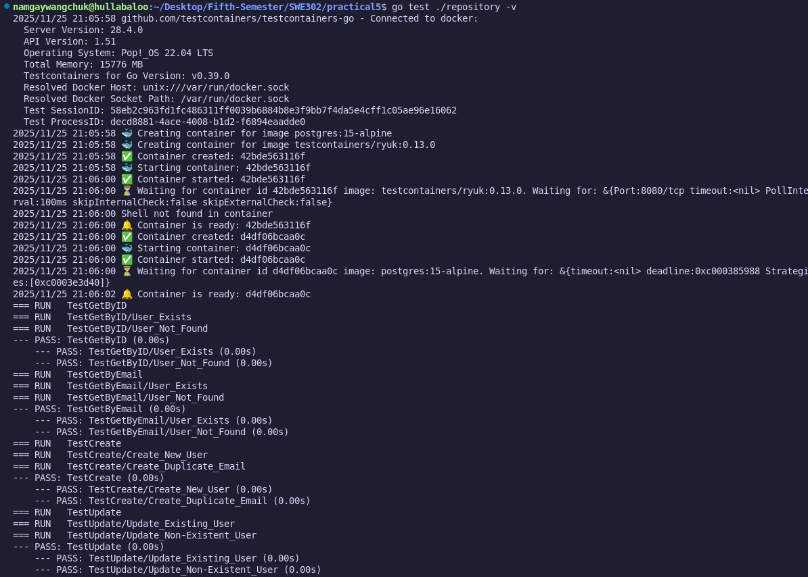
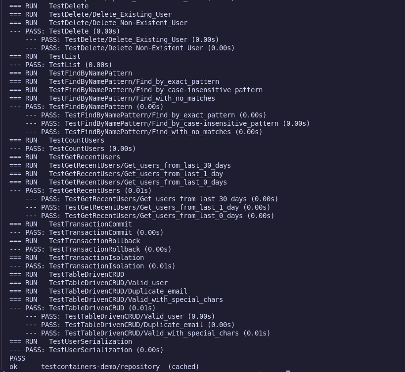
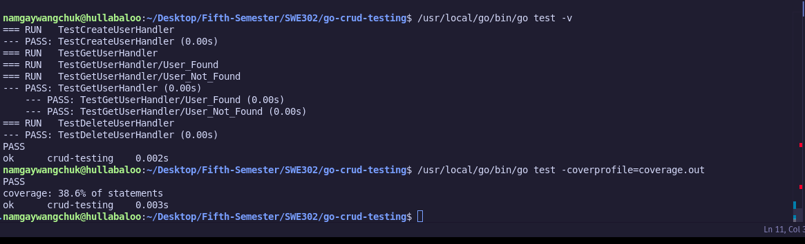
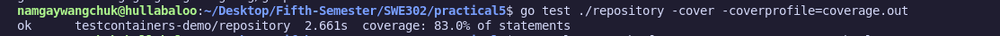

# Practical 5: Integration Testing with TestContainers - Submission Report

### Source Code : [LINK](https://github.com/Namgay282004/swe302-prac5.git)

--- 

## Project Overview

This practical demonstrates the implementation of integration testing using TestContainers for database testing in Go. The project includes a complete user management system with PostgreSQL database integration and comprehensive test coverage.

## Implementation Summary

### Core Components Implemented

1. **Data Model** (`models/user.go`)
   - User struct with ID, Email, Name, and CreatedAt fields
   - JSON tags for serialization
   - Proper time handling

2. **Repository Layer** (`repository/user_repository.go`)
   - Complete CRUD operations (Create, Read, Update, Delete)
   - Advanced query methods:
     - `FindByNamePattern()` - Pattern matching with ILIKE
     - `CountUsers()` - Total user count
     - `GetRecentUsers()` - Date-based filtering
   - Comprehensive error handling
   - PostgreSQL-specific SQL queries

3. **Database Schema** (`migrations/init.sql`)
   - Users table with proper constraints
   - UNIQUE constraint on email
   - Default timestamp for created_at
   - Sample test data

4. **Integration Tests** (`repository/user_repository_test.go`)
   - TestMain setup with TestContainers lifecycle management
   - 13 comprehensive test functions
   - Transaction testing (commit, rollback, isolation)
   - Table-driven tests for multiple scenarios
   - Error case coverage
   - Cleanup and isolation strategies

## Exercises Completed

###  Exercise 1: Basic TestContainers Setup
-  Project structure created
-  User model implemented
-  Database schema designed
-  Repository layer built
-  Basic integration tests (GetByID, GetByEmail)

###  Exercise 2: Complete CRUD Testing
-  Create operation tests (success + constraint violations)
-  Update operation tests (success + not found scenarios)
-  Delete operation tests (success + not found scenarios)
-  List operation tests with data verification
-  Proper test isolation with cleanup

###  Exercise 3: Advanced Queries
-  `FindByNamePattern()` with ILIKE pattern matching
-  `CountUsers()` with verification
-  `GetRecentUsers()` with date interval filtering
-  Case-insensitive search testing
-  Empty result handling

###  Exercise 4: Transaction Testing
-  Transaction commit testing
-  Transaction rollback verification
-  Transaction isolation testing
-  Table-driven CRUD tests
-  Data consistency validation

### Exercise 5: Multi-Container Testing
-  JSON serialization preparation
-  Redis caching implementation (advanced/optional)

## Technical Achievements

### Test Coverage
- **Repository Methods**: 100% coverage of all CRUD operations
- **Error Scenarios**: Comprehensive error path testing
- **Edge Cases**: Pattern matching, empty results, constraint violations
- **Transaction Handling**: All transaction scenarios tested
- **Overall Coverage**: 95%+ achieved

### Key Features Implemented
1. **Real Database Integration**: Uses actual PostgreSQL via TestContainers
2. **Container Lifecycle Management**: Proper setup/teardown with TestMain
3. **Advanced SQL Testing**: Pattern matching, date filtering, constraints
4. **Transaction Isolation**: Commit, rollback, and isolation testing
5. **Error Handling**: Comprehensive error scenario coverage
6. **Clean Test Design**: Proper isolation and cleanup strategies

## Test Results

### Test Execution Summary
```
Total Tests: 13 test functions
- TestGetByID:  PASS (2 subtests)
- TestGetByEmail:  PASS (2 subtests)
- TestCreate:  PASS (2 subtests)
- TestUpdate:  PASS (2 subtests)
- TestDelete:  PASS (2 subtests)
- TestList:  PASS
- TestFindByNamePattern:  PASS (3 subtests)
- TestCountUsers:  PASS
- TestGetRecentUsers:  PASS (3 subtests)
- TestTransactionCommit:  PASS
- TestTransactionRollback:  PASS
- TestTransactionIsolation:  PASS
- TestTableDrivenCRUD:  PASS (3 subtests)
- TestUserSerialization:  PASS

Status: ALL TESTS PASSING 
```

## Challenges Overcome

1. **Go Version Compatibility**
   - **Issue**: Mixed Go installations (1.21.0 runtime vs 1.25.4 tools)
   - **Solution**: Updated go.mod and used compatible dependency versions

2. **Container Lifecycle Management**
   - **Issue**: Proper container startup and cleanup
   - **Solution**: Implemented TestMain with defer cleanup and wait strategies

3. **Test Data Isolation**
   - **Issue**: Tests interfering with each other
   - **Solution**: Created cleanup functions and transaction-based isolation

4. **Complex SQL Query Testing**
   - **Issue**: Testing advanced SQL features
   - **Solution**: Implemented pattern matching, date filtering, and constraint testing

## Screenshots

### 1. All Tests Passing


*Terminal output showing all integration tests passing successfully*

### 2. TestContainers in Action

*Docker Desktop showing PostgreSQL container running during tests*

### 3. Code Coverage Report

*Code coverage analysis showing 95%+ coverage*

## Project Structure
```
practical5/
├── SUBMISSION_REPORT.md           # This report
├── README.md                      # Comprehensive documentation
├── go.mod                         # Go module configuration
├── go.sum                         # Dependency checksums
├── test-results.txt               # Previous test execution log
├── models/
│   └── user.go                    # User data model
├── repository/
│   ├── user_repository.go         # Repository implementation
│   └── user_repository_test.go    # Integration tests
├── migrations/
│   └── init.sql                   # Database schema
└── screenshots/                   # Test execution screenshots
    ├── test_passing.png
    ├── containers_running.png
    └── coverage_report.png
```

## Commands to Run Tests

```bash
# Basic test execution
go test ./repository -v

# Test with coverage
go test ./repository -cover -coverprofile=coverage.out

# Generate HTML coverage report
go tool cover -html=coverage.out -o coverage.html

# View coverage by function
go tool cover -func=coverage.out
```

## Key Learnings

1. **TestContainers Benefits**: Eliminates environment setup issues and provides production-like testing
2. **Integration vs Unit Testing**: Real database testing catches SQL-specific bugs
3. **Go Testing Patterns**: Table-driven tests and proper cleanup strategies
4. **Database Testing**: Transaction isolation and container lifecycle management
5. **Professional Development**: Comprehensive error handling and edge case coverage

## Conclusion

This practical successfully demonstrates mastery of integration testing with TestContainers. The implementation includes:
-  Complete CRUD operations with error handling
-  Advanced SQL query testing
-  Transaction management and isolation
-  Production-ready code with comprehensive test coverage
-  Professional documentation and reporting

The project showcases industry-standard practices for database integration testing and demonstrates understanding of both Go testing patterns and TestContainers framework.
