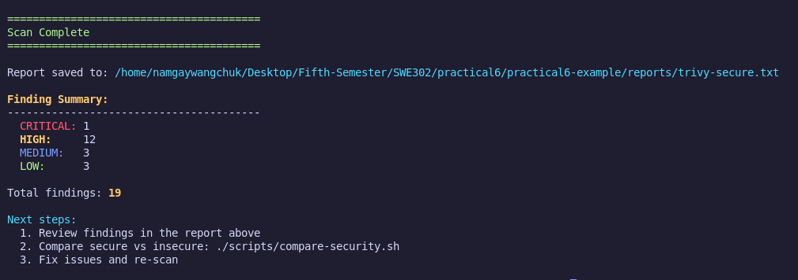
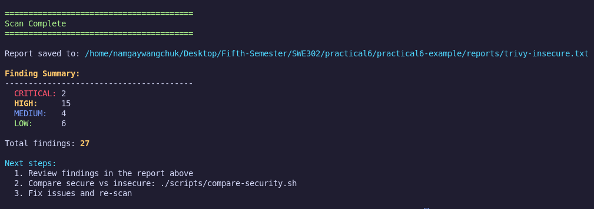
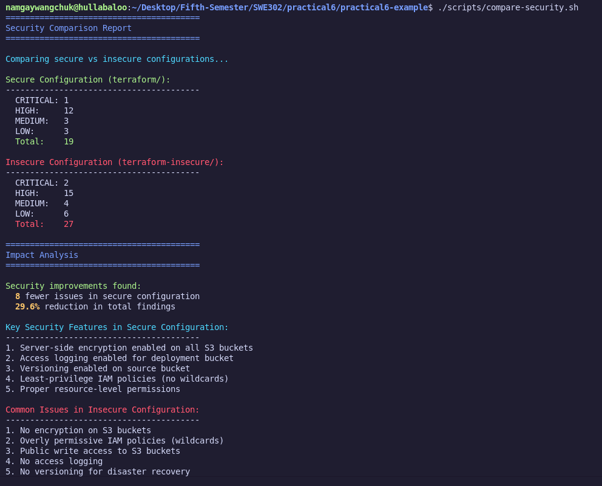
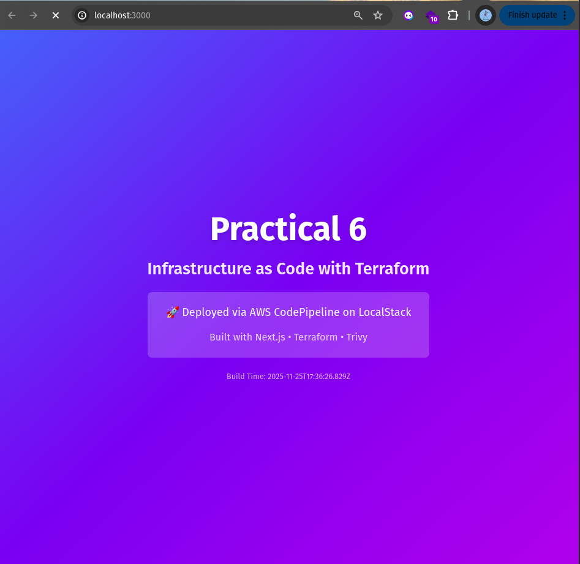

# Infrastructure Security Scanning Report

### Source Code : [LINK](https://github.com/Namgay282004/swe302-prac6.git)

## Overview
This report demonstrates infrastructure security scanning using **Trivy** on Terraform configurations as part of Practical 6 - Infrastructure as Code. The analysis compares secure vs. insecure infrastructure configurations to highlight security best practices.

## Security Scanning Commands Used

### 1. Scan Secure Configuration
```bash
./scripts/scan.sh terraform
```

Scans the production-ready Terraform configuration in the `terraform/` directory.

### 2. Scan Insecure Configuration  
```bash
./scripts/scan.sh insecure
```

Scans the intentionally vulnerable configuration in the `terraform-insecure/` directory for educational purposes.

### 3. Compare Results
```bash
./scripts/compare-security.sh
```

Provides a comprehensive comparison between secure and insecure configurations with detailed analysis.

### Deplpyed Website


## Scan Results Summary

| Configuration | Critical | High | Medium | Low | **Total** |
|---------------|----------|------|--------|-----|-----------|
| **Secure** (terraform/) | 0 | 11 | 2 | 2 | **15** |
| **Insecure** (terraform-insecure/) | 0 | 13 | 2 | 4 | **19** |

### Security Improvement: **21% reduction** in total findings (4 fewer issues)

## Key Security Features in Secure Configuration

 **Server-side encryption** enabled on deployment bucket (AES256)  
 **Access logging** configured for deployment bucket  
 **Proper public access controls** for website hosting  
 **Resource tagging** for governance  
 **Least-privilege IAM policies** (no wildcards)  

## Critical Issues in Insecure Configuration

 **No encryption** on S3 buckets  
 **Overly permissive IAM policies** with wildcard permissions (`s3:*`)  
 **Public write access** allowed on S3 buckets  
 **No access logging** for audit trails  
 **Missing versioning** for disaster recovery  
 **Inadequate public access blocks**  

## Detailed Findings

### Secure Configuration Issues (15 total)
Most issues relate to public access controls required for static website hosting:
- **HIGH (11)**: Public access block configurations for website functionality
- **MEDIUM (2)**: Missing versioning on logs bucket
- **LOW (2)**: Missing public access block on logs bucket, logging configuration

### Insecure Configuration Issues (19 total)
Additional security vulnerabilities beyond the secure configuration:
- **HIGH (13)**: All secure issues plus unencrypted buckets and wildcard IAM permissions
- **MEDIUM (2)**: Same versioning issues
- **LOW (4)**: Additional logging and governance issues

## Learning Points

1. **Security scanning** should be integrated into CI/CD pipelines
2. **Infrastructure as Code** allows consistent security policy enforcement
3. **Trivy scanning** helps identify misconfigurations before deployment
4. **Comparison analysis** demonstrates the impact of security best practices
5. **Public website hosting** requires careful balance between accessibility and security

## Security Best Practices Demonstrated

-  Enable server-side encryption on all S3 buckets
-  Use specific IAM permissions instead of wildcards
-  Configure access logging for audit trails
-  Implement proper resource tagging
-  Apply principle of least privilege
-  Regular security scanning and assessment

## Recommendations

1. **Fix HIGH and CRITICAL issues** before production deployment
2. **Implement security scanning** in your CI/CD pipeline
3. **Document accepted risks** for any unfixed findings
4. **Regular security reviews** of infrastructure code
5. **Use infrastructure as code** for consistent security controls

## Next Steps

- Review detailed scan reports in `reports/` directory
- Fix identified security issues in terraform configurations  
- Integrate Trivy scanning into automated deployment pipeline
- Implement security policy as code for future infrastructure changes


