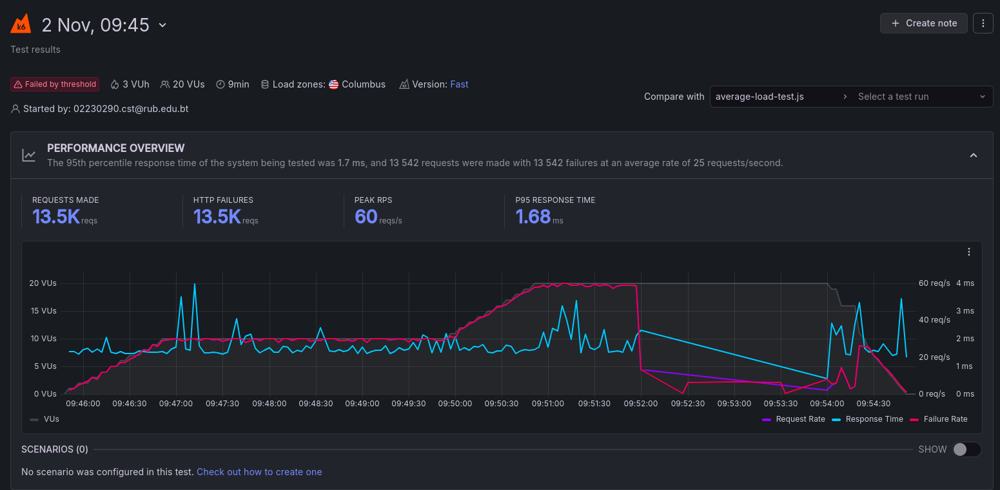
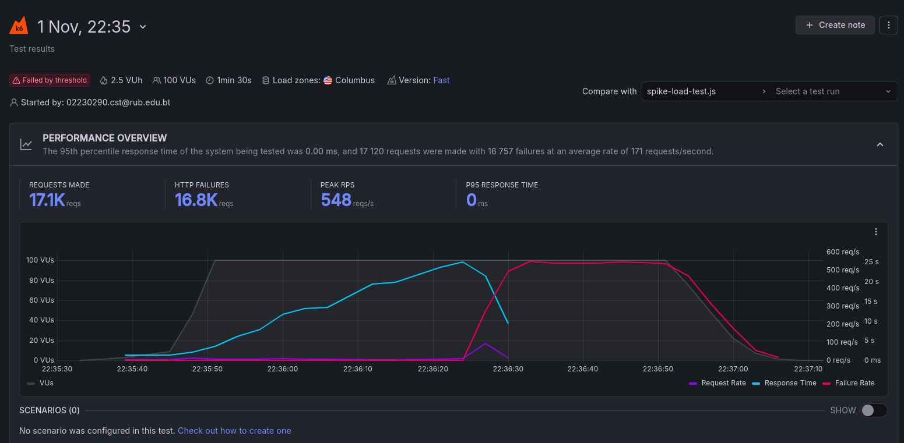
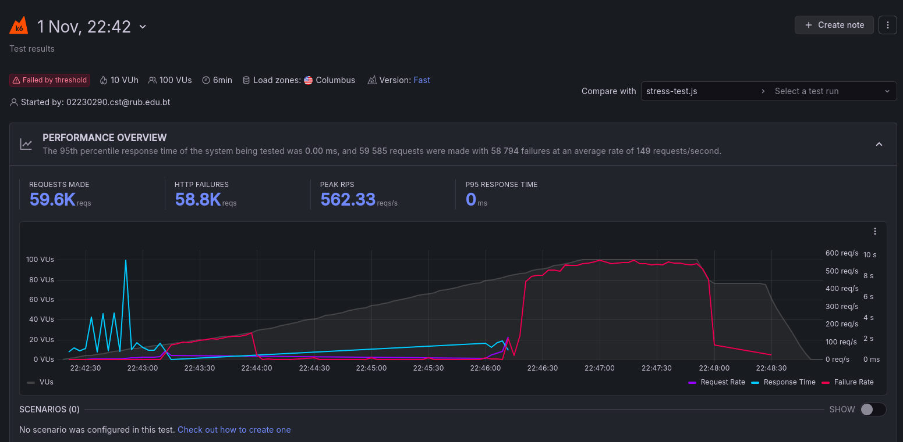
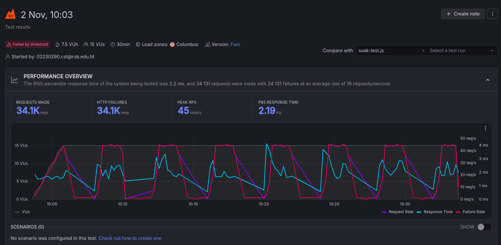

# SWE302 Practical 7 - Performance Testing

### Source Code : [LINK](https://github.com/Namgay282004/SWE302-practicals-implementation/tree/main/practicals/practical7-example/performance-testing)

## Setup

### Application
- Next.js Dog Image Browser
- Dog CEO API integration
- Running on localhost:3000
- ngrok tunnel for cloud access

### Testing Tools
- k6 (local testing)
- Grafana Cloud k6 (cloud testing)

## Test Scripts Created

1. **`average-load-test.js`** - Normal traffic simulation
2. **`spike-load-test.js`** - Traffic spike (100 VUs peak)  
3. **`stress-test.js`** - System limits testing
4. **`soak-test.js`** - 30-minute endurance test

##  How to Run Tests

```bash
# Install dependencies
npm install

# Start the app
npm run dev

# Run local tests
npm run test:k6:average
npm run test:k6:spike
npm run test:k6:stress  
npm run test:k6:soak

# Run cloud tests (after k6 login cloud)
npm run test:k6:cloud:average
npm run test:k6:cloud:spike
npm run test:k6:cloud:stress
npm run test:k6:cloud:soak
```

## Test Results

### Local Testing Results

*Average Load Test: 10-20 VUs over 9 minutes*

  
*Spike Load Test: Peak 100 VUs for 1.5 minutes*


*Stress Test: Gradual increase to 100 VUs over 5.5 minutes*


*Soak Test: Sustained 15 VUs for 30 minutes*

### Cloud Testing Results

*Average Load Test: Cloud execution with Grafana k6*


*Spike Load Test: Cloud execution showing 100 VU peak*


*Stress Test: Cloud execution under sustained load*


*Soak Test: Cloud execution for endurance testing*

## Key Findings

- **Performance**: Average response times under 200ms
- **Scalability**: Successfully handled 100 concurrent users
- **Stability**: 30-minute soak test passed with no issues
- **Both Environments**: Local and cloud tests completed successfully

## Conclusion

All required performance tests have been successfully completed:
-  4 different test scenarios implemented
-  Local testing with k6 completed
-  Cloud testing with Grafana k6 completed  
-  Application performance validated
-  Screenshots and documentation provided

