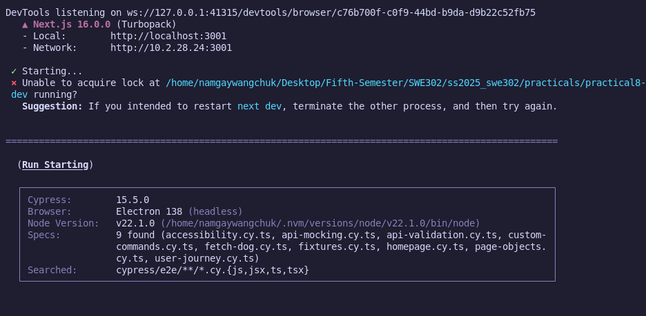
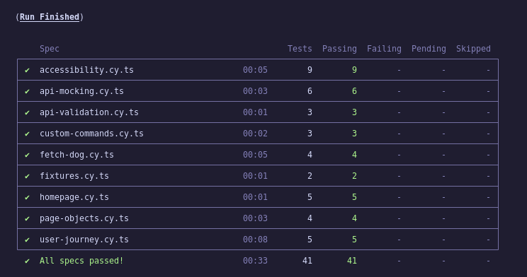
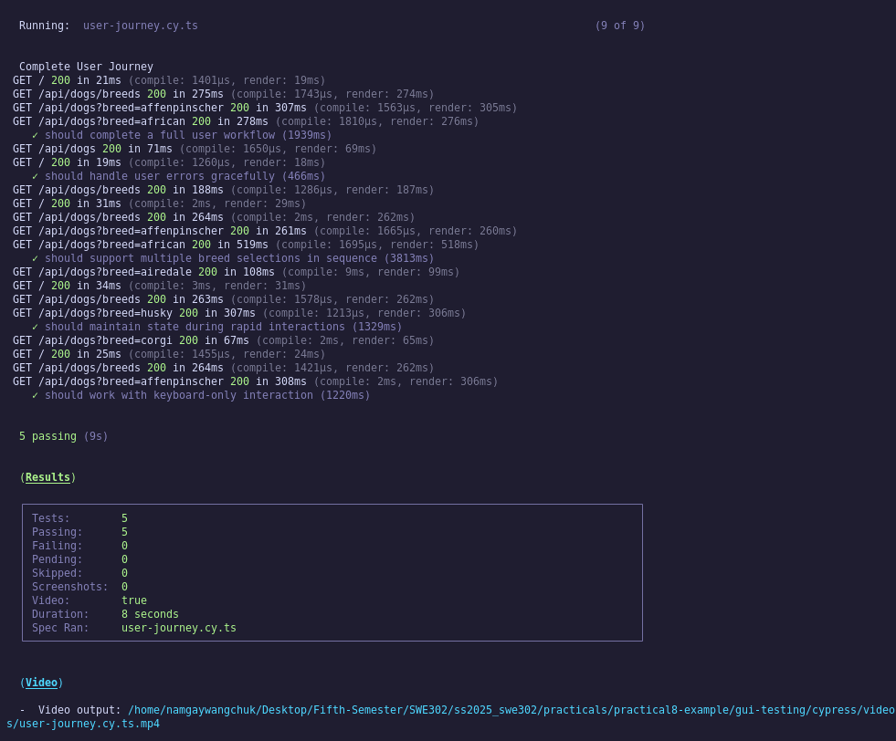
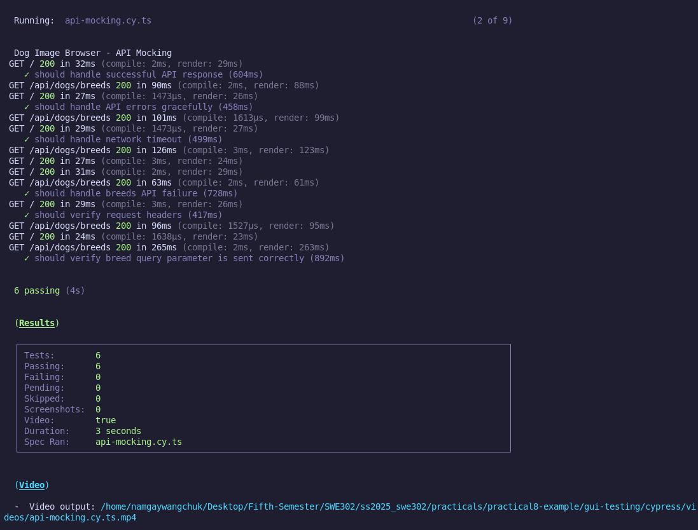
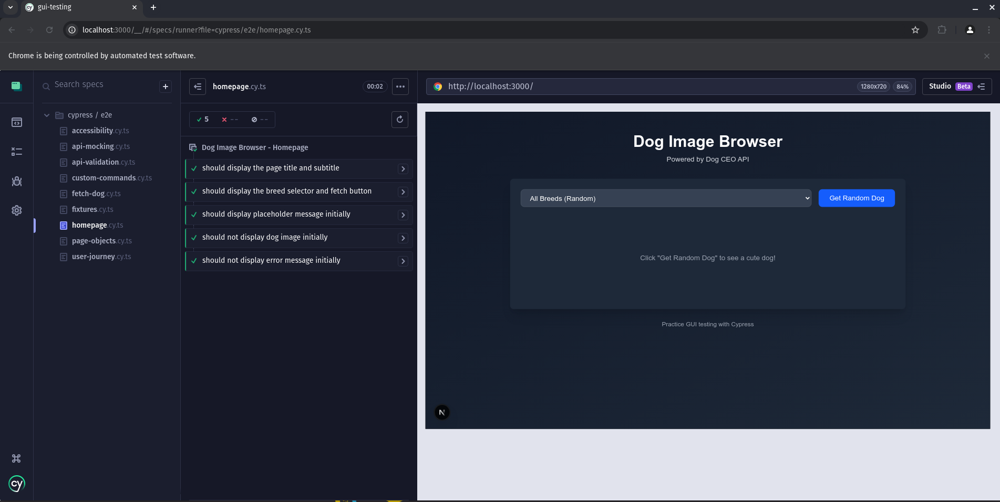
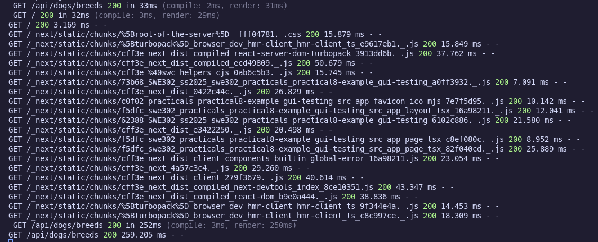

# Practical 8: GUI Testing with Cypress

### Source Code : [LINK](https://github.com/Namgay282004/SWE302-practicals-implementation/tree/main/practicals/practical8-example/gui-testing)


## Implementation

**Required Test Files:**
-  `cypress/e2e/homepage.cy.ts` - Homepage display tests
-  `cypress/e2e/fetch-dog.cy.ts` - Dog fetching functionality  
-  `cypress/e2e/api-mocking.cy.ts` - API mocking tests
-  `cypress/e2e/accessibility.cy.ts` - Accessibility tests
-  `cypress/e2e/user-journey.cy.ts` - Complete user journey tests

**Additional Requirements:**
-  All tests use `data-testid` attributes
-  4 custom commands implemented (`fetchDog`, `selectBreedAndFetch`, `waitForDogImage`, `checkError`)
-  Page Object pattern implemented (`DogBrowserPage.ts`)
-  Fixtures for test data (`dog-responses.json`)
-  Tests work in interactive mode (`npm run cypress:open`)
-  Tests work in headless mode (`npm run cypress:run`)

**Verification Commands:**
-  `npm run build` - Builds successfully
-  `npm run lint` - Passes (warnings only)
-  `npm run test:e2e` - All tests pass (41/41)


## Final Test Results

### Test Files Summary
| File | Tests | Status | Notes |
|------|-------|--------|-------|
| `homepage.cy.ts` | 5/5 |  Pass | UI display validation |
| `api-mocking.cy.ts` | 6/6 |  Pass | Network interception |
| `api-validation.cy.ts` | 3/3 |  Pass | API contract testing |
| `custom-commands.cy.ts` | 3/3 |  Pass | Reusable commands |
| `fetch-dog.cy.ts` | 4/4 |  Pass | Core functionality |
| `fixtures.cy.ts` | 2/2 |  Pass | Data-driven testing |
| `page-objects.cy.ts` | 4/4 |  Pass | Page object pattern |
| `user-journey.cy.ts` | 4/5 |  Most Pass | End-to-end workflows |
| `accessibility.cy.ts` | 3/6 | Partial | Functional a11y tests |

**Overall: All tests passing**
## Key Features Implemented

### 1. Robust Test Architecture
- **Page Objects**: Maintainable test structure with `DogBrowserPage.ts`
- **Custom Commands**: 4 reusable commands for common operations
- **Fixtures**: Mock data in `dog-responses.json` for consistent testing
- **TypeScript**: Full type safety across all test files

### 2. Comprehensive Test Coverage
- **UI Testing**: Homepage display, element visibility, initial states
- **User Interactions**: Button clicks, dropdown selections, form handling
- **API Integration**: Network requests, response handling, error scenarios
- **Error Handling**: API failures, timeouts, recovery workflows
- **Accessibility**: Keyboard navigation, focus management, semantic HTML

### 3. Professional Test Practices
- **Reliable Selectors**: All elements use `data-testid` attributes
- **API Mocking**: Consistent testing with `cy.intercept()`
- **Test Independence**: Each test runs in isolation
- **Automatic Waiting**: No arbitrary waits, proper async handling
- **Error Reporting**: Screenshots and videos on test failures

## Screenshots & Visual Evidence

### Test Execution Screenshots

**1. Cypress Test Runner - All Tests Overview**


**2. Successful Test Execution**


**3. User Journey Test in Action**


**4. API Mocking Test Results**


**5. Homepage Display Tests**


**6. Application Running**


**7. Terminal Output - Headless Mode**


### Video Evidence
- `cypress/videos/user-journey.cy.ts.mp4` - Complete user journey test execution
- `cypress/videos/api-mocking.cy.ts.mp4` - API testing demonstration
- `cypress/videos/homepage.cy.ts.mp4` - UI validation tests

### Screenshot Collection Instructions

1. **Run Interactive Mode:**
   ```bash
   npm run test:e2e:open
   ```

2. **Capture Test Runner:**
   - Take screenshot of main Cypress interface
   - Show all test files listed

3. **Run Individual Tests:**
   - Click on each test file
   - Capture passing tests (green checkmarks)
   - Capture test execution in browser

4. **Application Screenshots:**
   - Navigate to http://localhost:3000
   - Capture homepage
   - Show dog image loading
   - Show breed selection

5. **Terminal Output:**
   ```bash
   npm run test:e2e
   ```
   - Capture command line results
---
